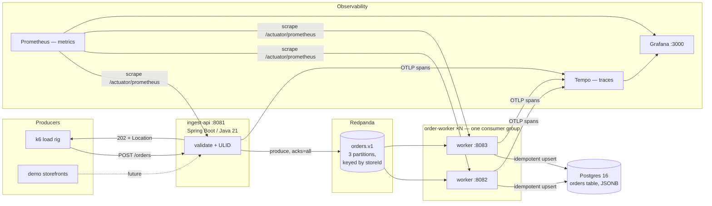

# Architecture — every layer, and why it's there

Companion to [DESIGN.md](DESIGN.md) (milestones/decisions log) and [FAILURE_MODES.md](FAILURE_MODES.md) (measured behavior). This doc explains the whole stack piece by piece: what each technology is, why it was chosen over the alternatives, and how the pieces interact.

## The system in one paragraph

A customer (or k6) POSTs an order to a small HTTP service that validates it, stamps it with a sortable unique id, drops it on a Kafka topic, and immediately answers "accepted." Independently, a pool of worker processes consumes the topic and writes orders into Postgres in a way that makes duplicate deliveries harmless. Every hop is traced, every service is measured, and the pipeline's behavior under load and mid-crash is documented with real numbers (~5,250 orders/s ingest, p99 7.2ms, zero loss with a worker killed mid-burst).

## Diagram



ASCII fallback:

```
k6 / storefronts
      │ POST /orders
      ▼
┌─────────────────┐  202 + ULID returned immediately
│   ingest-api    │───────────────────────────► caller
│ (Spring Boot)   │
└────────┬────────┘
         │ produce (key = storeId, acks=all)
         ▼
   ┌───────────────────────────┐
   │  Redpanda: orders.v1      │   ← the shock absorber
   │  3 partitions             │
   └─────┬───────────────┬─────┘
         ▼               ▼        one consumer group
   ┌───────────┐   ┌───────────┐  (kill one → rebalance,
   │ worker #1 │   │ worker #2 │   zero loss, proven)
   └─────┬─────┘   └─────┬─────┘
         └───────┬───────┘
                 ▼  INSERT ... ON CONFLICT (id) DO NOTHING
           ┌──────────┐
           │ Postgres │
           └──────────┘

  All services → OTLP traces → Tempo ─┐
  Prometheus ← scrapes /actuator ←────┼── Grafana (one pane)
```

## Layer by layer

### 1. Ingest — Spring Boot 3 on Java 21

**What it does:** `POST /orders` → bean validation → assign ULID → publish to Kafka → return `202 Accepted` with a `Location` header. Nothing else.

**Why a 202 and not a database write?** This is the load-bearing decision. A synchronous insert couples your public latency to your database's worst moment; the measured gap proves the point — ingest sustains ~5,250 orders/s while persistence runs ~500/s. The queue absorbs the spike; the caller gets a 7ms answer either way. Trade-off accepted: the caller holds an id for an order that isn't yet queryable (eventual consistency). For food orders that's fine — confirmation UX polls or subscribes.

**Why Java 21 + Spring Boot 3?** Deliberately boring: it's the stack of the target interviews and the owner's resume (Clear Street trading systems were Java/Spring/Kafka). Virtual-thread-era LTS Java. Boot 3 also carries the Micrometer Observation API, which is what makes the cross-service tracing nearly free (below). Go or Node would ingest just as well; they'd prove less in this context.

**Why ULIDs, generated in the API?** Order ids must exist before the DB row does (the 202 returns one). UUIDv4 would work but sorts randomly, which fragments B-tree indexes and makes ids useless for time-range queries. ULIDs are lexicographically time-sorted, 26 chars, and generated with zero coordination — no sequence, no DB round-trip, works across N ingest replicas. The idempotency story also hangs off this id (below).

### 2. The broker — Redpanda (Kafka protocol)

**What it does:** durable, partitioned log `orders.v1`. Producers append; consumer groups read at their own pace with tracked offsets.

**Why a log at all (vs. calling the worker directly, or a job queue like RabbitMQ)?** Three properties earned it: (1) *backpressure decoupling* — the 10× ingest/persist asymmetry is survivable because the log buffers it; (2) *crash semantics* — messages aren't deleted on delivery, so a consumer dying mid-work loses nothing, as the chaos test demonstrated; (3) *fan-out later* — an analytics consumer or the live dashboard (M4) can read the same stream without touching the order path. A classic queue gives (1), partially (2), and fights you on (3).

**Why Redpanda instead of Apache Kafka?** Wire-compatible with Kafka (every client, every concept, every interview answer transfers), but a single C++ binary — no ZooKeeper/KRaft ensemble — so local dev is one container that starts in seconds and idles light. In cloud it's also the cheap option (serverless tier). If a client mandated "real" Kafka, the code changes by zero lines.

**Why 3 partitions, keyed by `storeId`?** Partitions are the unit of parallelism — 3 partitions means up to 3 workers share the load. Keying by store gives per-store ordering (a store's orders arrive in the sequence placed, which matters for a kitchen screen) while different stores interleave freely. One partition would serialize everything; keying randomly would maximize parallelism but surrender ordering where it's actually wanted.

**Why `acks=all` + `linger.ms=5` on the producer?** `acks=all` means "don't tell the customer 202 until the broker has really got it" — the honest choice when the 202 is a promise. `linger.ms=5` lets the producer batch a few messages per request under load, buying throughput for ~5ms of worst-case added latency (invisible next to the 7ms p99).

### 3. Workers — Spring Kafka consumer group

**What it does:** `@KafkaListener` in group `order-workers`; for each message, one SQL statement:

```sql
INSERT INTO orders (...) VALUES (...) ON CONFLICT (id) DO NOTHING
```

**Why at-least-once + idempotency instead of exactly-once?** The central consistency decision. Kafka's delivery is effectively at-least-once here: offsets commit after processing, so a crash between "wrote the row" and "committed the offset" causes *redelivery*, never loss. Exactly-once semantics (Kafka transactions) exist but add coordinator overhead, config sprawl, and — critically — still can't make the *database* effect exactly-once without an outbox/dedup anyway. Instead, the write itself is idempotent: the ULID assigned at ingest is the primary key, and a replayed message is a no-op `ON CONFLICT`. Simpler, faster, and it visibly worked — the kill-test's in-flight redeliveries produced zero duplicate rows. This is the standard senior-engineer answer, implemented rather than recited.

**Why a consumer *group* (and 2 instances in the chaos test)?** The group protocol gives horizontal scaling and self-healing for free: partitions are divided among members, and when a member dies the broker reassigns its partitions to survivors (rebalance). Measured: worker killed hard mid-burst → group rebalanced to 1 member → 62,000/62,000 orders persisted.

**Known bottleneck, on purpose:** one INSERT per message ≈ 500 rows/s. JDBC batch inserts are the next milestone and should ~10× it. It's left visible because "measure, identify, then optimize" is the story worth telling — the before/after will be documented.

### 4. Storage — Postgres 16

**Why Postgres?** Orders are relational-ish business records that need ad-hoc querying (per store, per status, per day) and transactional integrity — the default answer is the right one. `customer` and `lines` live in **JSONB** columns: line items are read as a blob (print a ticket), never joined against, so normalizing them into rows would add joins for zero query value. The fields that *are* filtered on — `store_id`, `status`, `created_at` — are real columns with indexes. Hybrid schema: relational where you query, document where you don't.

**Why not a document store?** The unique-constraint (`id` PK) is what makes idempotency a one-liner, and `count(*) == count(DISTINCT id)` is what makes correctness *auditable*. Also: free tiers everywhere (Neon), and it's what real clients run.

### 5. Observability — OpenTelemetry → Tempo, Micrometer → Prometheus, Grafana

**What you get:** one distributed trace per sampled order — `POST /orders` (ingest) → `orders.v1 send` → `orders.v1 receive` (worker) → JDBC `query` — plus latency histograms, Kafka consumer metrics, and JVM metrics scraped from `/actuator/prometheus`.

**Why Micrometer's OTel bridge instead of the OTel Java agent?** Boot 3's Observation API instruments Spring's own components natively — enabling `spring.kafka.template.observation-enabled` and `listener.observation-enabled` is literally what carries the trace context inside the Kafka record headers across the async hop. In-code instrumentation is also visible in the repo (an agent hides everything at runtime), which is the point for a portfolio project. `datasource-micrometer` adds the JDBC spans.

**Why Tempo/Prometheus/Grafana and not a SaaS APM?** $0, runs in compose, and the query languages (TraceQL, PromQL) are transferable skills. On Azure (M5) the same OTLP stream points at Application Insights instead — exporter config, not code.

**Sampling is env-tunable (`TRACE_SAMPLING`)** — 100% in dev, 5% during load runs, because tracing every one of 410K requests would measurably pollute the latencies being published.

### 6. Load + chaos — k6

**Why k6?** Scenarios as versioned JavaScript in the repo (`load/orders.js`), built-in thresholds that turn perf claims into pass/fail (`p(99)<250`, `rate<0.001`), and it runs from a Docker image with no local install. The numbers it produced are in [FAILURE_MODES.md](FAILURE_MODES.md), including the honest caveats (single machine, untuned Postgres).

### 7. Dev infrastructure — Docker Compose, Gradle, foojay

- **Compose** pins the whole environment (Redpanda, Postgres+schema, Tempo, Prometheus, Grafana) to one `docker compose up`. Prometheus reaches host-side JVMs via `host.docker.internal`.
- **Gradle multi-module** (`ingest-api`, `order-worker`) — two independently deployable services, one build, shared conventions.
- **foojay toolchain resolver** auto-provisions JDK 21 regardless of what the machine has (this machine runs JDK 25) — clone-and-build works anywhere.

## What changes in production (M5 plan)

| Local | Azure | Why |
|---|---|---|
| Host JVMs | Container Apps (scale-to-zero) | ~$0 idle; owner's Azure certs |
| Redpanda container | Redpanda serverless / Container App | cheapest Kafka-compatible |
| Postgres container | Neon or Azure PG flexible burstable | free tier first |
| Tempo/Prometheus | Application Insights (same OTLP) | managed, cert-relevant |
| No auth (demo) | key auth + rate limit at ingress | public endpoint hygiene |

## Threads to pull in an interview

1. Why the 202 changes the latency story, with the measured 10× ingest/persist gap as evidence.
2. Walk one trace across the async boundary — where the context lives (record headers) and what enables it.
3. The kill-test: what at-least-once actually means, where duplicates come from, and why `ON CONFLICT` is the whole fix.
4. Partitioning as an ordering/parallelism dial, keyed to the domain (per-store).
5. What's deliberately not here: exactly-once transactions, outbox table, schema registry, K8s — and the point at which each earns its complexity.
